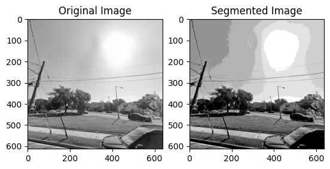

# Image Segmentation 
## Image Segmentation Using K-means Clustering, Gaussian Mixture model and Expectation Maximization
K-means clustering and Gaussian Mixture Models (GMM) are two popular methods for data clustering. K-means divides data into K clusters based on distance between data points, while GMM models the data as a combination of Gaussian distributions. The GMM method uses the Expectation-Maximization (EM) algorithm for parameter estimation. The EM algorithm alternates between an estimation step, which assigns data to clusters or distributions, and a maximization step, which updates the cluster/distribution parameters to better fit the data. Convergence is checked by evaluating the log likelihood, and the process is repeated until convergence is achieved. 

This study investigates the performance of the K-means algorithm and Gaussian Mixture Model (GMM) with Expectation Maximization (EM) for image segmentation. The K-means 
algorithm was implemented for grayscale and color images with and without intensity histograms. A custom function was developed for fitting data to Gaussian Mixture, which was used for grayscale and color image segmentation, and compared with the Gaussian Mixture class from sklearn library. The function was also used for fitting Gaussian Mixture to 2-D datasets and compared with the input signals. The study provides a comprehensive analysis of the strengths and limitations of K-means and GMM-EM for image segmentation.

### Scope and objectives of the project
The scope of this project is to perform image segmentation using concepts, ideas, and 
techniques covered in the course. The project objectives are as follows:
1) Learning the K-means algorithm: The K-means algorithm is a clustering technique used to 
partition a set of data points into K clusters based on similarity. The project aims to implement 
the K-means algorithm and its variations to gain proficiency in unsupervised learning 
techniques.
2) Learning Gaussian Mixture Model (GMM) and Expectation Maximization (EM): Gaussian 
Mixture Model (GMM) is a statistical model that uses a mixture of Gaussian distributions to 
represent a given set of data points. Expectation Maximization (EM) is an iterative algorithm 
used to estimate the parameters of a GMM. The project objective is to learn how to implement 
GMM and EM algorithms.
3) Implementing Image Segmentation: Image segmentation is the process of dividing an image 
into multiple segments or regions based on similar characteristics such as color, texture, or 
intensity. The project aims to apply the K-means algorithm and GMM/EM algorithms learned 
in objectives 1 and 2 for image segmentation.
4) Fitting 2-D Gaussian Mixture Data: The objective of this project is to learn how to fit 2-D 
Gaussian mixture data using the GMM and EM algorithms learned in objective 2

### The Introduction of Code_Files
  Scenario 1: It is required to implement the segmentation scheme for greyscale images using the K-means algorithm in two scenarios: using intensity histogram.  
  Scenario 2: It is required to implement the segmentation scheme for greyscale images using the K-means algorithm in two scenarios: without using intensity histogram. 
  Scenario 2.5: It is required to implement the segmentation scheme for color images using the K-means algorithm.  
  Scenario 3: It is required to implement the segmentation scheme for color images using the GMM and EM algorithm.  
  Scenario 4: It is required to implement the segmentation scheme for color images using the GMM and EM algorithm.  
  Scenario 5: It is required to implement its own function for fitting the Gaussian mixture model to data and compare the convergence plot with that provided in the project requirement's pdf file.
 

### The Introduction of Segmented Images

